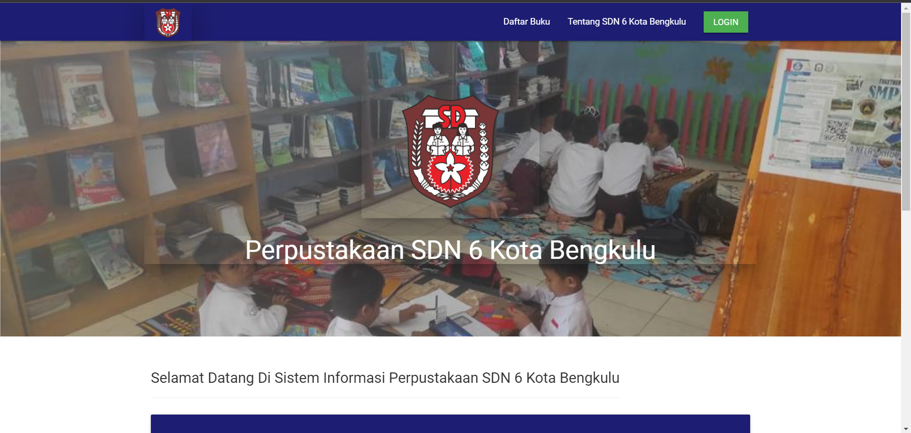
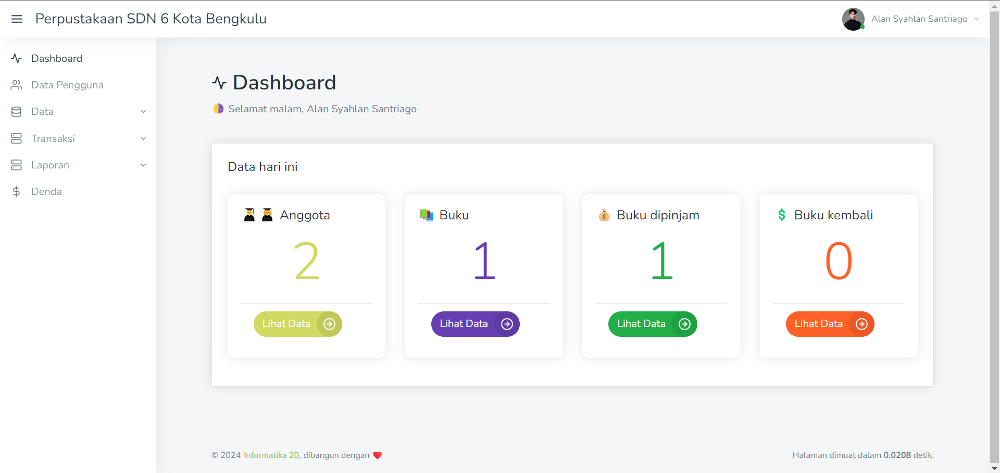
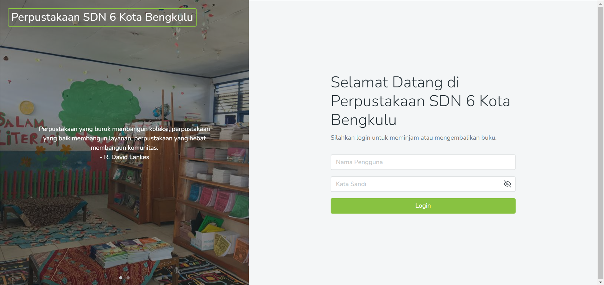

## Sistem Informasi Perpustakaan SDN 6 Kota Bengkulu
Sistem Informasi Perpustakaan SDN 6 Kota Bengkulu adalah sebuah sistem yang dirancang untuk mengelola dan mempermudah proses administrasi perpustakaan di Sekolah Dasar Negeri 6 Kota Bengkulu. Tujuan utamanya adalah untuk meningkatkan efisiensi pengelolaan koleksi buku, peminjaman, pengembalian, dan pencatatan aktivitas perpustakaan.

## Preview

 

 

 

## Tech
Codeigniter 3.1.11

## default login
untuk login di sistem
### petugas perpustakaan
username: alan 
password: 123456

### anggota perpustakaan
username: bambang 
password: 123456
